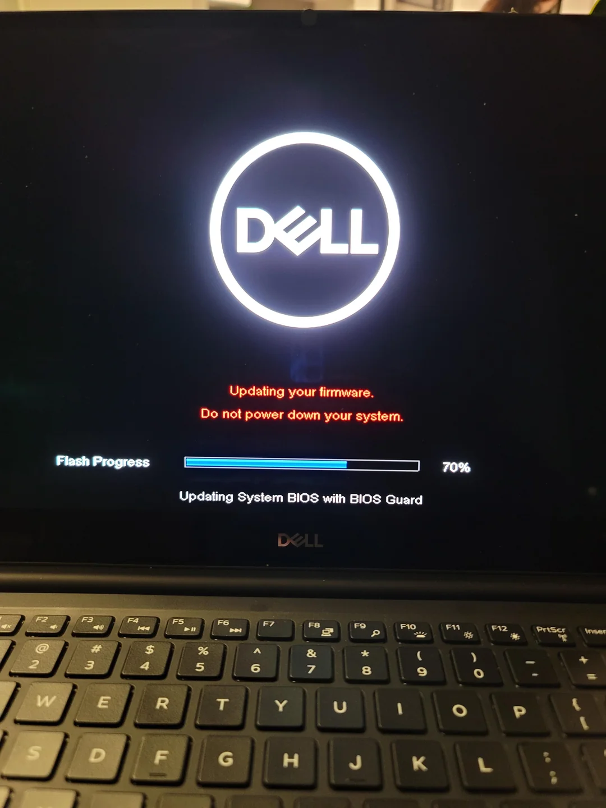

# Notes on the Bootloader

## Scope

We will restrict our discussion below to computers with processors that
implement the x86-64 computer architecture. Further, we will only
consider bootloaders that interface with an implementation of the BIOS 
(Basic Input/Output System) firmware standard.

UEFI (Unified Extensible Firmware Interface) is a more modern firmware
standard, which removes many of the limitations the BIOS imposes on the
bootloader. For instance, the BIOS requires that the bootloader's
instructions:

1. fit into 512 bytes;
2. only use the first megabyte of the computer's memory; and
3. be compiled as binary.

By contrast, UEFI is able to understand several file systems. This 
removes the first constraint by allowing developers to write 
bootloaders whose instructions vary in their size. This size seems to 
be restricted only by the file system's limits and the computer's disk 
space. 

Further, the UEFI allows the bootloader to use the entirety of the 
computer's memory. Finally, the UEFI also understands executable 
formats, which means the bootloader's instructions no longer need to be 
compiled in raw binary machine code.

We will further discuss some of these comparative advantages of the 
UEFI below in passing. But we will neglect the problem of how a 
bootloader might be written to interface with a UEFI firmware.

## Preliminaries: The BIOS

### EEPROM: Where the BIOS is stored

A BIOS implementation is a program that is stored in non-volatile
memory, i.e., storage that the CPU can access directly, and whose data
persists even after its computer shuts down. This memory medium used to
be ROM (read-only memory) whose contents were hard-wired during the
ROM's manufacture and could not be changed.

But more recently, EEPROM (Electrically Erasable Programmable Read-Only
Memory) has displaced ROM. As its name suggests, the contents of an 
EEPROM can be changed after the fact, by being erased and rewritten
electrically. Flash memory is an instance of EEPROM.

This move from ROM to EEPROM allowed the BIOS to be rewritten. Indeed,
this is even done remotely these days, as can be witnessed in the 
screenshot below, where the BIOS of a Dell computer is being updated
with BIOS Guard. 

This image was actually taken by [a concerned owner](https://www.reddit.com/r/Dell/comments/pg8vxs/is_this_normal_for_dell_to_issue_an_over_the_air/) who thought it was 
strange to have the firmware updated remotely. Others also [shared the
worry](https://www.dell.com/community/en/conversations/windows-10/my-windows-10-laptop-updated-and-there-was-also-bios-firrmware-update/647f8794f4ccf8a8de6cfc30).

### Real Mode: The Operational Environment of the BIOS 

Regardless of the storage medium, when a computer is turned on, the
BIOS program stored in the medium is executed by the CPU. The CPU
executes the BIOS in _real mode_, where only 16-bit instructions can be
processed, and a mere 1MB of RAM memory space is available. 

16-bit instructions use 16-bit registers (e.g., `ax`, `bx`, `cx`, etc.) 
and their 8-bit subsections (e.g., `al`, `ah`). They consist of the 
instructions that were available to Intel's 16-bit CPUs (e.g. the 8086 
processor, developed in the 1970s). 

Every memory address in real mode corresponds to a real location on the 
RAM's physical memory grid. This is why the operational mode is called 
'_real_ mode'. Further, memory is often used in real mode in accordance 
with the _segmentation memory model_.

In this model, when we want to write to or read from a memory address 
`L`, we do so by specifying:

1. an address `A`, where `A <= L`; and
2. `L - A`, which is the number of bytes we must add to `A` to reach 
`L`.

We might call the first the 'base address' from which we begin our
memory access. As for the second, it's usually called the 'offset'.

A _segment selector_, then, is the value we get when we divide a base 
address by 16, or 2 bytes. Segment selectors are stored in _segment
registers_. It is by storing values in such registers that we configure
our desired base address. Among the most often used segment registers
are:

1. cs, for 'code segment';
2. ss, for 'stack segment';
3. ds, for 'data segment'; and
4. es, for 'extra segment'.

So suppose that we are writing a routine that we know will be loaded at 
memory address `0x7c00`. Assume further that we have some data, perhaps 
a string, defined at an offset of 8 bytes from the start of the 
program. Then, we might store the value `0x7c0` in the `ds` register
(since `0x7c0 == 0x7c00 / 0x10`, where `0x10` equals decimal 16), and 
use the offset to access our data, such that, if `L` is the location of 
our data,

`L == ds * 0x10 + 0x8`.

Alternatively, suppose that we have two routines, `R1` and `R2`, and we 
don't want them to share the same memory space. Then we can assign one
set of segment-register values `S1` to `R1`, and another set `S2` to 
`R2`. Next, when we want to run `R1`, we can load `S1` into our segment
registers, and when we want to execute `R2`, we can load `S2`.

Thus, the segmentation memory model is best thought of as a memory-use
scheme. It is _not_ a memory organization scheme. That is, the model
does not imply that there exist unalterable, predefined segments in
memory that the user must leverage to access RAM. 

Every computer that implements an x86 architecture turns on in real 
mode. But if such a computer uses a BIOS implementation, the CPU's
operational environment stays in real mode until it is changed by the
bootloader. By contrast, if the computer uses a UEFI firmware, the UEFI
itself can transition the CPU to operate in _protected mode_ or _long
mode_ before passing on control to the bootloader.

Protected mode offers a 32-bit, and long mode a 64-bit, instruction
set. And both offer much larger memory usage than real mode, with long
mode offering more than protected mode.

### What the BIOS Does

To return to the BIOS itself, the program does several things, but most
prominently, it:

1. runs a Power-On Self-Test, or POST, which checks to ensure that the
core hardware of the computer (the processor, RAM, etc.) is functioning 
normally; 
2. initializes an interrupt vector table; and
3. searches for and loads a boot sector.

#### The Interrupt Vector Table

The Interrupt Vector Table, roughly speaking, is a list of memory
locations that the BIOS loads into RAM. The first location in the list
is assigned the number 0, the second location, the number 1, and so on,
until the 256-th location is given the number 255. These numbers are
called _interrupt vectors_.

Each memory location corresponds to the starting address of a routine,
or _interrupt handler_. These routines can be invoked either directly
or indirectly. They can be invoked directly by an interrupt instruction
issued in assembly. More specifically, we can append an interrupt
vector to an `int` instruction, in order to invoke the routine stored 
at the memory location corresponding to that vector. For example, 
`int 0x0` would run the routine stored at the first memory location, 
which has the interrupt vector 0.

On the other hand, interrupts can also be invoked indirectly. For
example, if we attempt to divide by 0, the interrupt routine with
vector 0x0 is invoked by the CPU. This response by the CPU is something
that has been hardwired, i.e., implemented in the CPU's hardware. Thus,
certain operations are such that executing them would cause the CPU to
automatically invoke an interrupt handler. When the operation is
considered to be an error, the operations are _exceptions_ and the
interrupt handler is called an _exception handler_.

4 bytes, segment selector + offset, 255, so 1024 bytes, or 1 kilobyte.
Stored from memory location 0.

#### Loading the Boot Sector 

A sector is a section of a storage device, such as a floppy disk, 
CD-ROM, hard drive, etc. A boot sector is a 512-byte-large sector, the
first 510 bytes of which are reserved for the bootloader program, and 
the last two bytes of which contain the value `0x55` in the 511-th
address, and `0xAA` in the 512-th address. These two values effectively
serve as metadata, to indicate that the preceding 510 bytes contain
code for the bootloader, and that the 512 bytes collectively should be
treated as a boot sector.

The BIOS, then, searches for a boot sector by going through, 
sequentially, a list of storage devices. This list is called the _boot
order_ or _boot sequence_. When the BIOS identifies a sector of such a
device as a boot sector, it loads the 512 bytes of the sector into
memory, starting at the address `0x7c00`. The CPU then starts executing
the bootloader from that address.

One last crucial function of the bootloader is that it initializes an
interrupt vector table, mapping interrupts to... 

As we will see, it also supports an interrupt vector table,
much like an OS does, such that we can issue what are effectively
system-call interrupts from the bootloader, which the BIOS will then 
proceed to handle.   

Thus, the BIOS is the loader that loads the bootloader. The bootloader
is called a 'loader' because it, in turn, will load the operating
system kernel.

## The Bootloader

Describe how the bootloader written for PeachOS works. The main object
of the assembler is to assemble a 512-mb stretch of binary code that
fits into the boot sector. 
